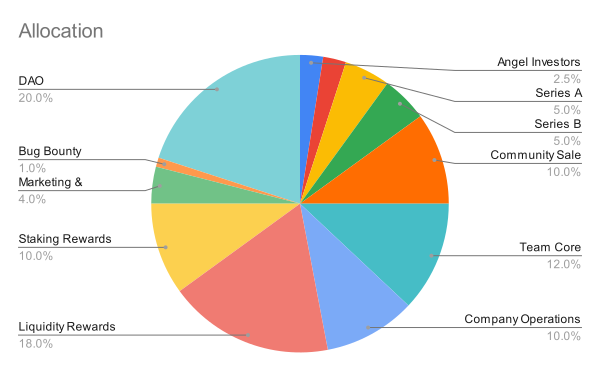

# Governance and Tokenomics

Emmet.Finance's token bridge project incorporates a robust governance framework and tokenomics model to ensure sustainable development, community engagement, and effective decision-making within the ecosystem. This section outlines the key components of governance and tokenomics implemented by Emmet.Finance.

## Governance Framework

### Decentralized Governance
Emmet.DAO embraces a decentralized governance model, allowing token holders to participate actively in decision-making. Through a consensus mechanism, such as on-chain voting or delegated voting, token holders can propose and vote on important matters related to the token bridge's development, upgrades, parameter changes, and overall ecosystem governance.

### Governance Token
The token bridge ecosystem features a governance token that grants holders the right to participate in governance activities. Token holders can stake or delegate their tokens to vote on proposals, elect representatives, and influence the project's direction. The governance token acts as a means of community participation and fosters a sense of ownership among the token holders.

### Proposal Process
The governance framework includes a transparent proposal process where token holders can submit proposals for consideration. Proposals can cover various aspects, such as technical improvements, ecosystem expansion, new features, security enhancements, or changes to tokenomics. The community can review, discuss, and vote on these proposals, ensuring a democratic decision-making process.

### Community Representation
Governance mechanisms may include provisions for electing community representatives or delegates who actively participate in governance discussions and decision-making on behalf of the broader community. These representatives bring diverse perspectives and ensure the inclusion of different stakeholder interests in the governance process.

## Tokenomics Model

### Utility of the Token

The token bridge ecosystem's native token is central in facilitating cross-chain token transfers and participating in the governance process. 
 The token is used for the following purposes:

#### Rewarding Bridge Validators
Token holders who participate in the validation process of the token bridge are rewarded with tokens for their efforts in maintaining the network's security and integrity.

#### Bridge Fee Payment
When users initiate token transfers across chains using the token bridge, a small fee is charged in the native token. These fees contribute to the sustainability of the ecosystem and incentivize network participants to provide liquidity and support the bridge's operations.

#### Transaction Fees
Token holders may be required to pay transaction fees in the native token when performing various actions within the ecosystem, such as token transfers, governance voting, or accessing additional services.

#### Governance Participation
Holding and staking the native token grants token holders the right to participate in governance activities, such as voting on proposals, electing representatives, and shaping the future development of the token bridge ecosystem.

#### Token Distribution
The initial distribution of the native token is carefully designed to align incentives, foster community participation, and ensure a fair distribution of ownership. Distribution methods may include token sales, airdrops, liquidity mining, or community allocations. Consideration is given to avoiding excessive concentration of tokens in a small number of hands and promoting broad-based ownership and engagement.

The total supply of 1,000,000,000 will be distributed the following way:

|Investments (25%)|Allocation share|Tokens|
|:-|:-:|:-:|
|Angel Investors| 		  2.5%| 	  25,000,000
|Seed| 				  2.5%| 	  25,000,000
|Series A| 			  5%| 	  	  50,000,000
|Series B| 			  5%| 	  	  50,000,000
|Community Sale| 		10%| 		100,000,000

The total token allocation for investments is 250,000,000 tokens.

|Ecosystem(75%)|         	Allocation share|	    Tokens|
|:-|:-:|:-:|
|Team Core| 			12%| 		120,000,000
|Company Operations| 	10%| 		100,000,000
|Liquidity| 			18%| 		180,000,000
|Staking rewards| 		10%| 		100,000,000
|Marketing & Partnerships| 	   4%| 	  	  40,000,000
|Bug Bounty| 			   1%| 	  	  10,000,000
|DAO| 				20%| 	200,000,000

The total token allocation for the ecosystem activities is 750,000,000 tokens.

#### Incentive Mechanisms
Tokenomics includes various incentive mechanisms to promote desired behaviors and contributions within the ecosystem. For example, participants may be rewarded with tokens for providing liquidity, staking tokens, securing the network, actively participating in governance activities, or contributing to the development of the token bridge ecosystem.

#### Token Buybacks and Burns
To manage the token's supply and value, tokenomics may include periodic token buybacks or token burns. These activities can help maintain a healthy token economy, reduce supply over time, and increase the token's scarcity, potentially leading to price appreciation and enhanced value for token holders.

#### Transparent Reporting and Auditing
Emmet.Finance is committed to maintaining transparency and accountability by providing regular reports and updates on the token bridge ecosystem's progress, development milestones, and financial aspects. These reports may include information on token distribution, tokenomics adjustments, governance activities, and financial audits. External audits may be conducted to ensure the accuracy and integrity of financial records and token-related activities.

***

By incorporating a robust governance framework and well-designed tokenomics model, Emmet.Finance aims to empower the community, encourage active participation, and drive the sustainable growth of the token bridge ecosystem. Through decentralized decision-making and transparent token economics, Emmet.Finance strives to create an inclusive and vibrant ecosystem where stakeholders have a voice and play an active role in determining the project's path.
